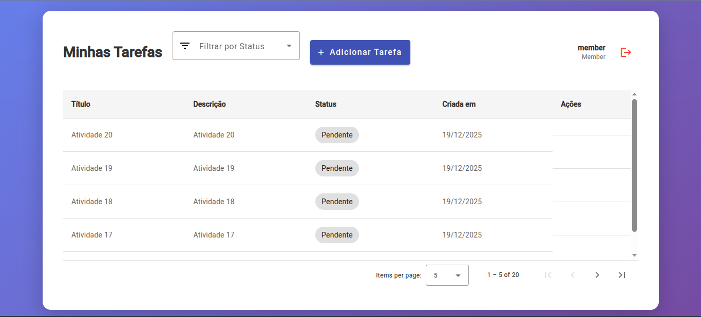

# 🏢 BIM Workplace - Sistema de Gestão de Tarefas



## 📋 Sobre o Projeto

Sistema de gestão de tarefas com controle de acesso baseado em roles (RBAC), desenvolvido com **.NET 8.0**, **Angular 16** e **PostgreSQL**. A aplicação implementa autenticação JWT e autorização granular por permissões, permitindo diferentes níveis de acesso conforme o papel do usuário no sistema.

---

## 🚀 Tecnologias

- **Backend**: .NET Core 8.0, Entity Framework Core, JWT Authentication
- **Frontend**: Angular 16, Angular Material
- **Banco de Dados**: PostgreSQL
- **Containerização**: Docker & Docker Compose

---

## 📦 Pré-requisitos

- [.NET 8.0 SDK](https://dotnet.microsoft.com/download/dotnet/8.0)
- [Node.js](https://nodejs.org/) (versão 16 ou superior)
- [Docker](https://www.docker.com/) e [Docker Compose](https://docs.docker.com/compose/)
- [Angular CLI](https://angular.io/cli) (opcional, mas recomendado)

---

## 🛠️ Instalação e Execução

### 1. Banco de Dados

O banco de dados PostgreSQL é gerenciado via Docker Compose. Para iniciar o banco de dados, execute:

```bash
docker-compose up -d
```

Os dados do banco ficarão persistidos em `.docker/postgres_data`.

### 2. Backend

O backend foi construído em **.NET Core 8.0** com **Entity Framework Core**.

**Passos para executar:**

```bash
# Instalar as dependências
dotnet restore

# Compilar o projeto
dotnet build

# Executar o projeto
dotnet run
```

Após executar, o servidor estará disponível em: **http://localhost:5197**

**Observações importantes:**

- Sempre que o servidor for iniciado, um **DBSeeder** é executado automaticamente para popular o banco de dados com 3 usuários de teste, cada um com uma role diferente (Admin, Manager e Member).
- O backend está documentado via **Swagger UI**: http://localhost:5197/swagger/index.html
- Todas as rotas são protegidas por **JWT**, exigindo autenticação

**Endpoints principais:**

- `POST /login` - Autenticação (recebe email e senha, retorna token JWT)
- `GET /tasks` - Listagem de tarefas
- `POST /tasks` - Criação de tarefa
- `PUT /tasks/{id}` - Atualização de tarefa
- `DELETE /tasks/{id}` - Exclusão de tarefa

### 3. Frontend

O frontend foi construído com **Angular 16** e **Angular Material**.

**Passos para executar:**

```bash
# Navegar até a pasta do frontend
cd WorkplaceTasks-Web

# Instalar as dependências
npm install
# ou
yarn install

# Executar o projeto
ng serve
# ou
npm start
```

O frontend estará disponível em: **http://localhost:4200**

---

## 🏗️ Arquitetura

### Backend - Clean Architecture

O backend foi estruturado seguindo os princípios de **Clean Architecture**, dividido em 3 camadas principais:

#### 📁 Domain
Camada responsável por guardar somente as entidades do projeto, como `UserTask`, `TaskItem`, e enums (`RoleEnum` e `TaskStatus`).

> **Nota**: A entidade de tarefa foi nomeada como `TaskItem` ao invés de `Task`, pois estava gerando conflitos com nomes de outras bibliotecas do .NET e quebrando o build.

#### 📁 Infrastructure
Camada responsável pela persistência dos dados, contendo:
- Configurações das tabelas (Entity Framework)
- `DbContext` da aplicação
- **DBSeeder**: popula a tabela de usuários para realização de testes
- Repositórios: realizam a persistência dos dados no banco de dados

#### 📁 Application
Camada de negócio externa, responsável por:
- Recepcionar os dados vindos dos endpoints
- Tratar e validar os dados
- Persistir no repositório
- Devolver o resultado para o endpoint

> Cada feature possui sua própria pasta, seguindo o padrão **Design By Feature**.

### Frontend - Clean Architecture

O frontend também segue os princípios de **Clean Architecture**, organizado em 3 pastas principais dentro de `app`:

#### 📁 Shared
Contém o módulo `SharedModule` que é incluído em cada novo módulo com itens comuns a todos. Também possui o `MaterialModule` com todos os módulos do Angular Material utilizados no projeto.

#### 📁 Core
Contém o core da aplicação:
- **Guards de rota**: proteção de rotas baseada em autenticação/autorização
- **Interceptor**: injeta o token JWT nas requisições HTTP
- Pode conter outras funcionalidades como `utils.ts` para cálculos, formatação de datas, etc.

#### 📁 Modules
Contém os módulos da aplicação, seguindo o padrão **Design By Feature** e **Lazy Loading**:
- Cada feature possui seu próprio módulo
- Melhora a performance, carregando cada módulo somente quando necessário
- Cada módulo possui:
  - **Domain**: controllers, use cases e components
  - **Infra**: repositório para comunicação com a API

**Observações técnicas:**

- Em ambiente de desenvolvimento, foi implementado **proxy reverso (reverse proxy)** para evitar erros de CORS comuns em aplicações Angular
- Foram implementados `environments` (environment e environment.prod) para suporte a diferentes ambientes
- Utilizado o padrão **Observable** do RxJS
- Não foi implementado controle de estados com RxJs, mas poderia ser adicionado caso necessário

---

## 👥 Usuários para Testes

O sistema vem pré-configurado com 3 usuários de teste, cada um com uma role diferente:

| Role | Email | Senha |
|------|-------|-------|
| **Member** | `member@bimworkplace.com` | `member123` |
| **Manager** | `manager@bimworkplace.com` | `manager123` |
| **Admin** | `admin@bimworkplace.com` | `admin123` |

### 🔐 Permissões por Role

#### Admin
- Acesso total a todos os endpoints e recursos
- Pode criar, ler, atualizar e excluir qualquer tarefa
- Pode gerenciar usuários e atribuir roles

#### Manager
- Pode criar tarefas
- Pode ler todas as tarefas
- Pode atualizar qualquer tarefa
- Pode excluir apenas tarefas que criou

#### Member
- Pode criar tarefas
- Pode ler tarefas
- Pode atualizar apenas tarefas que criou
- Pode excluir apenas tarefas que criou

---

## 📱 Telas do Sistema

O sistema possui duas telas principais:

1. **Login**: Tela de autenticação do usuário
2. **Tasks**: Tela responsável por gerenciar todas as tarefas de acordo com as permissões estabelecidas

---

## 💭 Considerações Finais

O sistema foi desenvolvido de forma simples e otimizada, buscando clareza para o usuário e proporcionando uma boa experiência de uso.

Apesar do desafio não exigir um design elaborado, foi utilizado uma IA para melhorar o visual, deixando-o mais fluido e moderno.

**Decisão arquitetural**: Optei por separar o backend em sub-projetos ao invés de pastas, pois prefiro trabalhar desta forma, facilitando a organização e manutenção do código.

---

## 🔮 Melhorias Futuras

### Frontend
- Layout mais atrativo e responsivo
- Utilização mais ampla de RxJs para tratamento de dados
- Implementação de Providers para desacoplamento entre frontend e backend
- Controle de estados com **NgRx (Store)** para carregar informações úteis (como usuário logado) de forma mais rápida e organizada
- Implementação de loading indicators mais robustos
- Melhor tratamento de erros com feedback visual

### Backend
- Implementação de Controllers para deixar os endpoints mais organizados
- Utilização do padrão de projeto **Facade** para simplificar interfaces complexas
- Implementação de paginação e filtros por status (bônus do desafio)
- Melhorias na documentação da API
- Implementação de testes unitários e de integração

---

## 📝 Decisões Técnicas

- **Clean Architecture**: Escolhida para manter a separação de responsabilidades e facilitar a manutenção
- **Design By Feature**: Aplicado tanto no backend quanto no frontend para melhor organização do código
- **Lazy Loading**: Implementado no frontend para melhorar a performance
- **JWT Authentication**: Escolhido por ser stateless e escalável
- **Entity Framework Core**: Utilizado para facilitar o trabalho com o banco de dados PostgreSQL
- **Angular Material**: Escolhido para agilizar o desenvolvimento da UI

---

## 📄 Licença

Este projeto foi desenvolvido como parte de um desafio técnico.

---

## 👨‍💻 Autor

Desenvolvido com foco em boas práticas, clareza de código e arquitetura bem estruturada.
